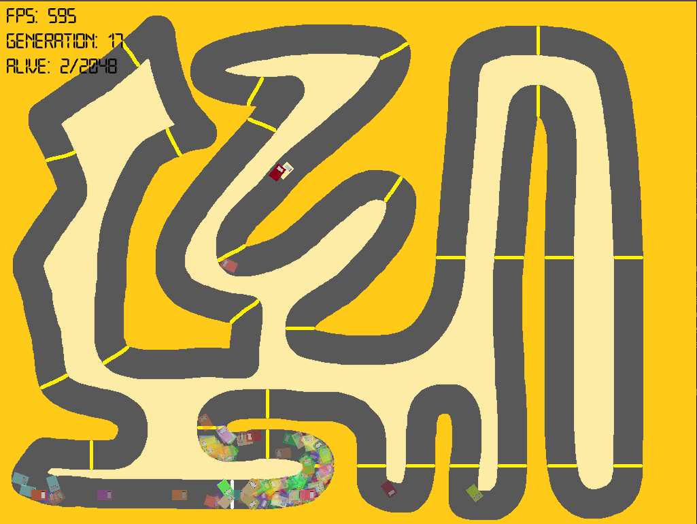
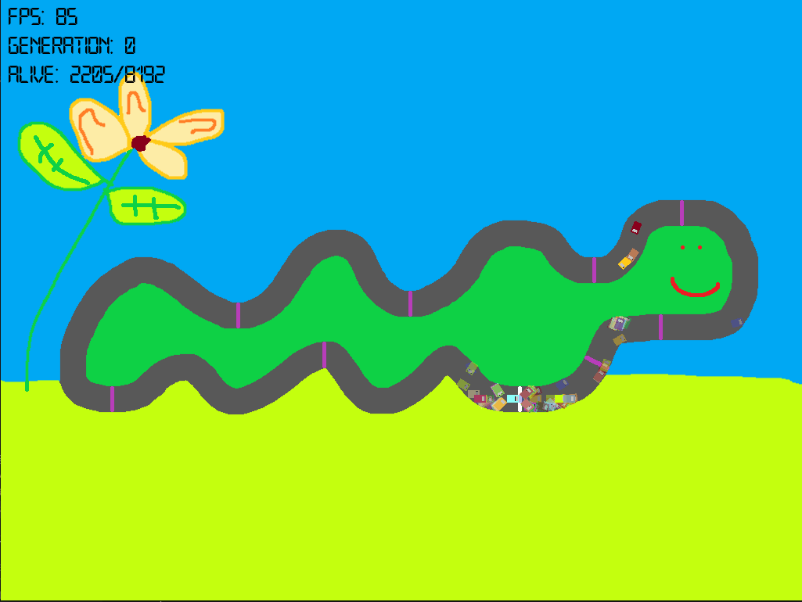

# RL-Cars :red_car:
RL-Cars takes a brute-force approach to reinforcement learning by attempting to teach a car to navigate a track over serveral generations.

## How does it work?
This project doesn't use any neural network or machine learning libraries! The neural nework is written from scratch and will attempt to teach a collection of cars to drive over an unlimited number of generations.

Each car has it's own neural network which controls the next action every frame. The neural networks input layer takes the distance in five directions: left, top left, middle, top right, and right as input parameters (these lines can be drawn by setting `DRAW_INPUT_LINES=1` in `setup.config`) which are fed through the neural network with applies randon weights/bias' to the input to reach the output layer. The output layer consist of four neuron which denote the direction to move the car on the next frame, this is forwards, backwards, turn left, turn right. The output layer neuron with the highest value will be chosen as the next action to perform.

The cars are scored by counting the number of waypoints they have past in the shortest time, a faster car is ranked higher if the same number of waypoints are passed on two cars. If a car crashesl, i.e. a boundry of the car leaves the track, the car will stop and wait for the remaining cars on the track to stop (crash). The car which with the highest score is flagged as the best perforing car and the weights & bias' of this car are copied into every other core for the next generation with random offsets. This is done in an attempt to brute-force a better performing car in the next generation. One car will always have the same weights & bias' as the best performing car from the previous generation so it isn't possible to regress across generations.

## Playing with the config file
Parts of the program can be tweaked without editing the code base via the `setup.config` file. To make changes during runtime, press `r` to hot reload the program.

### Settings:
`FONT` the font used to draw the text overlay.

`TRACK` the track to load from the `./tracks` directory.

`THREAD` the number of threads to create, more threads allows for more car batches, but will slow down the program.

`CARS_PER_THREAD` the number of cars to run in each thread, more will increase the chances of generating a better peroforming car.

`NETWORK_HIDDEN_COUNT` the number of hidden layers in the neural network.

`NETWORK_NEURON_COUNT` the number of neurons in each hidden layer of the neural network.

`CAR_MOVE_SPEED` the speed a car will accelerate per frame (moving forwards/backwards).

`CAR_MAX_SPEED_MULTIPLIER` the maximum speed a car can move per frame.

`CAR_ROTATE_SPEED` the speed a car will rotate per frame.

`DRAW_INPUT_LINES` draw the input lines for each car which are fed as the input parameter to the neural network.

`DUMP_BEST_NETWORK` write the best performing cars' neural networks weights and bias' to the console after each generation.

## Running RL-Cars

> SFML is used as the render engine. Download from [their website](https://www.sfml-dev.org/).

RL-Cars is written in C++ and compiled with `g++`, you can run the following command to build locally:

`make compile` to compile the source files and generate an executable file.

`make go` to compile the source code and run the generated executable.

## Enjoy!

